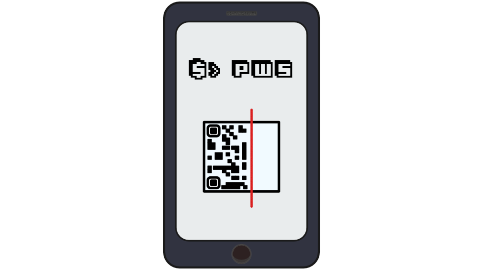

# pwsqr [](https://rubygems.org/gems/pwsqr)

> Simple QR interface to pws gem. Helps to use your passwords on a smartphone.

## Installation

[PWS gem](https://github.com/janlelis/pws) required to use this tool and will be installed as a dependency if you don't have one already.

```
$ gem install pwsqr
```

## Usage

This gem helps you securely and easily copy/send passwords from CLI (`pws` tool) to your mobile devices using QR codes.

When `pwsqr` works online it tries to use [onetimesecret.com](https://onetimesecret.com) service to store your password privately behind the QR code with a short URL.

To use this feature, run pwsqr with `pwsqr --init` command first and setup your email address and API key in the newly generated config file in your `$HOME` directory: `~/.pwsqr`

If you want to generate config file from scratch delete the old one before running `pwsqr --init`

```
$ pwsqr --help


    ======================================================
            Command-line QR tool for PWS gem 📲
    ======================================================

    Usage:
      pwsqr [--offline | --email] [--namespace <namespace>] <key>
      pwsqr --version
      pwsqr --help
      pwsqr --init

    Options:
      --version, -v                              Show the current app version
      --help, -h                                 Show this message
      --init                                     Initialise new configuration (won't break the old one)
      --namespace <namespace>, -n <namespace>    Use custom pws namespace
      --offline, -o                              Force local password usage (force offline usage,
                                                 mind the length of the password and terminal history)
      --email, -e                                Send a friendly email containing the secret link
```

```sh
# Home
$ pwsqr twitter # get twitter password (online/QR)
$ pwsqr -e twitter # get twitter password (online/email)
$ pwsqr -o twitter # get twitter password (offline/QR)

# Work
$ pwsqr -n work -o github # get github password (offline/work namespace/QR)
$ pwsqr -n work github # get github password (online/work namespace/QR)
$ pwsqr -n work -e github # get github password (online/work namespace/email)
```

Then you check your email (if you used `--email` / `-e` flag) or scan QR-code with any QR scanner (I use really fast one: [Optiscan QR Code Reader](https://itunes.apple.com/us/app/optiscan-qr-code-scanner-generator/id304099767) ⚠️ **this is not an advert**)

## To-Do

* [ ] Testing
* [ ] Configure CI
* [ ] Code documenting

## Contributing

See [contributing.md](./contributing.md)

## License / Copyrights

* [MIT](./LICENSE) © 2012 - 2016 [Serge Bedzhyk](https://github.com/smileart)
* Image font source: [3Dventure](http://www.dafont.com/3dventure.font)
